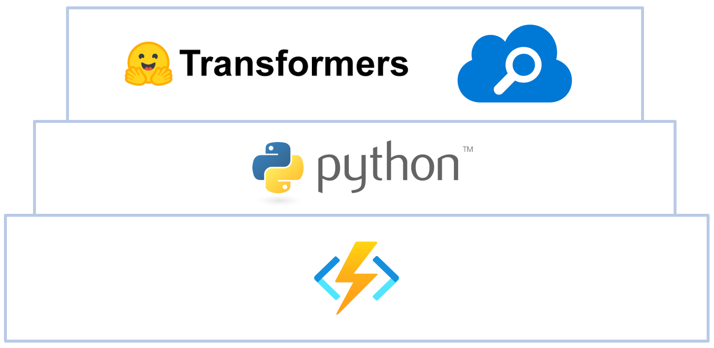
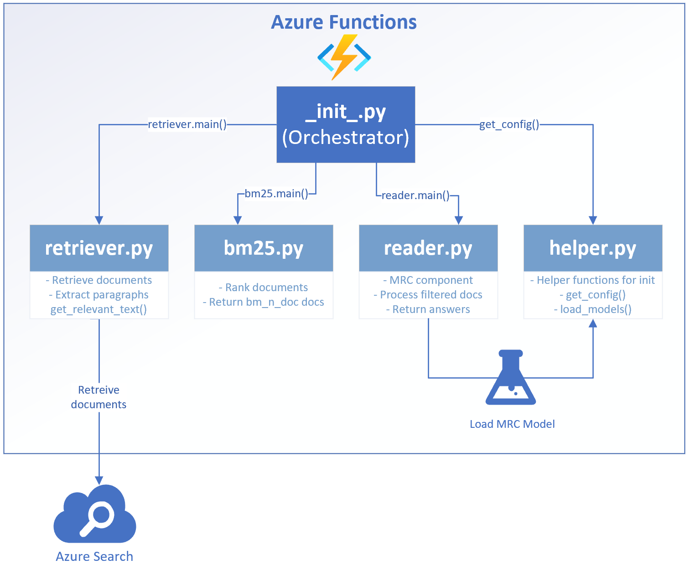

# Machine Reading Comprehension with Azure Cognitive Search
This documentation serves to describe the technical setup of a Machine Reading Comprehension (MRC) component in an Azure Function, how to deploy and as well as how to use it. In this setup, we require the combination with Azure Cognitive Search, so that documents retrieved from the index given an input question can be processed using a MRC model. The component has been implemented in Python 3.7.

## Definition of Machine Reading Comprehension (MRC)
- Machine Reading Comprehension (MRC), or the ability to read and understand unstructured text and then answer questions about it remains a challenging task for computers
- MRC is a growing field of research due to its potential in various enterprise applications, as well as the availability of MRC benchmarking datasets (MSMARCO, SQuAD, NewsQA, etc.)

## Tech Stack
The technical components of the MRC function look as follows:


### Azure Functions
The basis of the MRC is an [Azure Functions](https://docs.microsoft.com/en-us/azure/azure-functions/functions-overview) component, which is a serverless infrastructure type offered on Microsoft Azure. It acts as webservice and can be triggered as REST-API. Basically, it is available in multiple setups such as C#, JavaScript and Python - in this case we use Python and recommend to use the Python 3.7 runtime. The minimum scale level should be either AppService or ideally Premium plan. The description to the respective plans can be found [here](https://docs.microsoft.com/en-us/azure/azure-functions/functions-scale). Depending on your scale, a Function, a storage account and an App Service Plan is deployed in your subscription when creating the resource intially.

### Python
The Python packages that are additionally required are `azure-functions`, `torch`, `torchvision`, `transformers`, `azure-search-documents` and `nltk`. Further, they are listed in the `requirements.txt` with the respective version numbers. When deploying the service, it will automatically be used for transferring and installing it.

### Azure Search
- [Azure Cognitive Search](https://azure.microsoft.com/en-us/services/search/) is the only cloud search service with built-in AI capabilities that enrich all types of information to easily identify and explore relevant content at scale. Formerly known as Azure Search, it uses the same integrated Microsoft natural language stack that Bing and Office have used for more than a decade, and AI services across vision, language, and speech. Spend more time innovating and less time maintaining a complex cloud search solution.
- In this setup, it is used as document retriever to look up for documents which may be related to an incoming question

### Transformers
- Transformers provides thousands of pretrained models to perform tasks on texts such as classification, information extraction, question answering, summarization, translation, text generation, etc in 100+ languages. Its aim is to make cutting-edge NLP easier to use for everyone.
- Transformers provides APIs to quickly download and use those pretrained models on a given text, fine-tune them on your own datasets then share them with the community on our model hub. At the same time, each Python module defining an architecture can be used as a standalone and modified to enable quick research experiments.
- Transformers is backed by the two most popular deep learning libraries, PyTorch and TensorFlow, with a seamless integration between them, allowing you to train your models with one then load it for inference with the other.
- In our setup, Transformers are used to search the text returned by Azure Functions and the filtering mechanisms of our pipeline.
- The pre-trained models are available on [huggingface.co](https://huggingface.co/models). Usually, they are downloaded directly by the script, however this may be restricted depending on the company policy, as the models are hosted on AWS.

## Architecture
The MRC component receives a request from the API backend after a user types in a specific question he or she wants to loop up for. The Function sends a request to the Azure Cognitive Search, asking for a collection of documents matching to the incoming question. After receiving the results, the documents are processed and checked for potential answers. The Function responds with a JSON containing the potential answers.

## Code and Process Flow
We followed a modular approach for the code, so that every script may be executed separately to try out changes autonomously. The files in the root folder are predominantly skeleton files for the Azure Function. The main function itself is stored in the `MRC` subfolder. When a request is received by the endpoint of the Azure Function, it is going to handled as illustrated below:



## `__init__.py`
- Orchestration script of the `MRC` function
- Gets triggered after the function receives a request, accepts the request body and orchestrates the call of all other submodules
- After document processing, a response json is packed by the `__init__.py`

## `helper.py`
- The helper provides functions that are required for the runtime without being executable standalone
- Further, it allows to keep the `__init.py__` clean
- The `get_config()`-function of the helper gets called by the `__init__.py` to collect the parameters and eventually fill up missing ones with standard values
- The `load_model()`-function is called by the `reader.py` to load the pre-configured model. It has been separated from the reader to allow extensions for further models without affecting the reader itself

## `retriever.py`
- The document retriever is the first processing component that gets triggered
- Based on the input question, the Azure Search gets queried and returns `n` (optional query parameter, default == 5) documents that match to the respective string
- The results are filtered based on the `treshold` (optional input parameter, treshold is TF/IDF-score, default == 5)
- Afterwards, the highlighted text is extracted and with help of `extract_relevant_text()`-function, the relevant text from the paragraph around the highlight is extracted
- For the extraction of relevant text, a custom sentence tokenizer is used, which is activated by default based on the parameter `tokenize` (optional parameter, default == True), which can be set to `False` (not recommended)
- We always have to make a cut at 500 characters, as it is the maximum length of a documents to be processed by the MRC
- If the part of the document does not exist in our list yet, we add it as potential candidate to be "read" by the MRC component later on
- The collection of documents with their respective metadata is returned to the orchtestrator

## `bm25.py`
- In the next step, we run a [Okapi Best Match 25](https://en.wikipedia.org/wiki/Okapi_BM25) on the collection of documents, if the document collection is larger than `bm_n_doc` (optional input parameter, default == 3)
- It is a ranking algorithm that filters the documents again for the best match to an input question in order to reduce the processing time of a large amount of documents. On this way we only process the most relevant documents. However, relevant documents might also be filtered out. If you do not want to use it as preprocessing any more, just comment it out in `__init__.py`, as below, and redeploy:
    ```python
    # Apply BM25, if more than n documents
    # if documents and len(documents) > bm_n_doc:
    #    documents, sources = bm25.main(question, documents, sources, bm_n_doc)
    ```
- The results are scored and the `bm_n_doc` documents with the highest scores get returned and passed to the orchestrator again

## `reader.py`
- This is the stage where the actual MRC happens. The pre-selected documents get applied on a pre-trained transformer model, which is specialized in MRC
- The models get loaded as described in `helper.py`, as there are multiple choice options which model to put into production. We recommend going for the active `deepset/bert-large-uncased-whole-word-masking-squad2`. You can expect significantly shorter processing times with the other models, however they do not perform so well in reading documents and also show difficulties with case-sensitive documents
- The reader checks, whether a model is available in the `models/bert`-subfolder. If no model can be found, a download is initiated from the huggingface API, given the security policies from the VNET allow it  
- With help of tokenization and some parameters, which are set in `reader.py`, all the pre-selected documents get processed and checked for potential answers to a question
- If there is a match, the reader returns the respective documents to the orchestrator

The files and folders listed in `.funcignore` are not deployed to the function as they are either not needed or not wanted in the infrastructure component, e.g. as they are just for local development.

## Request and Responses
The section below shows example inputs and outputs how to trigger the function and pass values to the processing pipeline as well as the return.

### Request
The request below shows the minimal setup of a request with the mandatory parameters.

The link to the function usually looks as following:<br>
`https://just-mrc-test.azurewebsites.net/api/MRC?code=abcde312321hnIeA812345556blablablablablabla==`<br>
It is based on the structure:<br>
`https://{function resource name}.azurewebsites.net/api/{function name}?code={access code}==`

You can either send a request body or the address string, however we recommend using the request body as shown below:
```json
{
    "question": "Who is the CEO of Microsoft?"
}
``` 

If you want to pass further optional parameters to tweak the results a bit, look at the following body:
```
{
    "question": "Who is the CEO of Microsoft?",
    "az_documents": 8,
    "az_treshold": 10,
    "az_tokenize": False,
    "bm_ndoc": 8
}
``` 

As already described above, their meaning and default values would look as following:
```
{
    "question": "Who is the CEO of Microsoft?",
    "az_documents": 5, // documents to be requested from the Azure Search
    "az_treshold": 5, // minimum TF-IDF relevance score to accept the document from Azure Search
    "az_tokenize": True, // tokenize sentences to extract paragraphs
    "bm_ndoc": 3 // amount of documents to be returned by BM25
}
``` 
An increase of `az_documents` and `bm_ndoc` may lead to a larger document corpus with a greater likeliness to find a match, however they may increase the processing time significantly. Decreasing `az_treshold` may also increase this effect. Deactivating the sentence tokenizer `az_tokenize` may lead to smaller text chunks, which may reduce the recognition quality.

### Response
The service will return a json as below, in case a match has been found. There may be multiple entires in the `answers` section. The service also returns references to the document `title`, the `metadata_storage_name` as well as `document_id` and `document_uri`.
```json
{
    "answers": [
        {
            "answer": "Satya Nadella",
            "title": "Leadership - Stories",
            "metadata_storage_name": "senior-leaders.html",
            "document_id": "https://news.microsoft.com/leadership/?section=senior-leaders",
            "document_uri": "https://news.microsoft.com/leadership/?section=senior-leaders"
        }
    ],
    "counts": {
        "documents": 3,
        "answers": 1
    }
}
``` 

## Operations
The section below describes the frameworks to be installed locally before you can get started testing, debugging and deploying the service.

### Local Installation
First, you have to install/set up following components:
1. PowerShell
    - [Azure Command Line Interface (CLI)](https://docs.microsoft.com/de-de/cli/azure/install-azure-cli), command line tools for Azure using PowerShell
    - [Azure Functions Core Tools](https://docs.microsoft.com/de-de/azure/azure-functions/functions-run-local?tabs=windows%2Ccsharp%2Cbash#v2), download for your local runtime environment, e.g. as `.exe` -> _v3.x: Windows 64-Bit_
    - A restart is highly recommended or even required after installing these components, otherwise you will run into issues!
2. Python 3.7
    - From the [Windows Store](https://www.microsoft.com/en-us/p/python-37/9nj46sx7x90p?activetab=pivot:overviewtab) or from [Python](https://www.python.org/downloads/release/python-379/), make sure you install `pip` and set Python as `path` variable during the installation
3. Postman
    - Framework to test endpoints, download it [here](https://www.postman.com/downloads/)

### Testing and Debugging
1. Get your code from Azure DevOps or the respective repository (07 - SCIO MRC)
1. Create a virtual environment <u>outside</u> of the project folder: `python –m venv venv`
1. Activate the virtual environment: `source venv/bin/activate` (Linux) or `venv/Scripts/activate` (Windows), `deactivate` um zu deaktivieren
1. Install the requirements: `pip install -r requirements.txt`
1. Set your keys (only for local development and debugging) in the `config.ini` (they are needed for the Azure Search request)
1. After the initial installation, run `func init` in the root folder (verifies if all necessary skeleton files for the function are available)
1. For debugging and local testing, open a separate PowerShell window and execute `func host start --verbose` in the root folder of the function. This enables you to do code changes during runtime without shutting down the function completely when there is an issue
1. Use [Postman](https://www.postman.com/downloads/) for testing the endpoints using the localhost request of this [collection](assets/MRC-Requests.postman_collection.json)

### Deployment to Azure
1. Open your PowerShell
1. Activate your environment, if you haven't before: <br>
`source venv/bin/activate` (Linux) or `venv/Scripts/activate` (Windows)
1. Login to your Azure Account: `az login` (a browser window will open, where you may have to log on Azure)
1. Execute the command:<br> 
`func azure functionapp publish [insert your function name] --remote build`
1. Wait until the deployment is finished
1. Use [Postman](https://www.postman.com/downloads/) for testing the endpoints using this [collection](assets/MRC-Requests.postman_collection.json)

## Contributing
This project welcomes contributions and suggestions.  Most contributions require you to agree to a
Contributor License Agreement (CLA) declaring that you have the right to, and actually do, grant us
the rights to use your contribution. For details, visit https://cla.opensource.microsoft.com.

When you submit a pull request, a CLA bot will automatically determine whether you need to provide
a CLA and decorate the PR appropriately (e.g., status check, comment). Simply follow the instructions
provided by the bot. You will only need to do this once across all repos using our CLA.

This project has adopted the [Microsoft Open Source Code of Conduct](https://opensource.microsoft.com/codeofconduct/).
For more information see the [Code of Conduct FAQ](https://opensource.microsoft.com/codeofconduct/faq/) or
contact [opencode@microsoft.com](mailto:opencode@microsoft.com) with any additional questions or comments.

## Trademarks
This project may contain trademarks or logos for projects, products, or services. Authorized use of Microsoft 
trademarks or logos is subject to and must follow 
[Microsoft's Trademark & Brand Guidelines](https://www.microsoft.com/en-us/legal/intellectualproperty/trademarks/usage/general).
Use of Microsoft trademarks or logos in modified versions of this project must not cause confusion or imply Microsoft sponsorship.
Any use of third-party trademarks or logos are subject to those third-party's policies.
